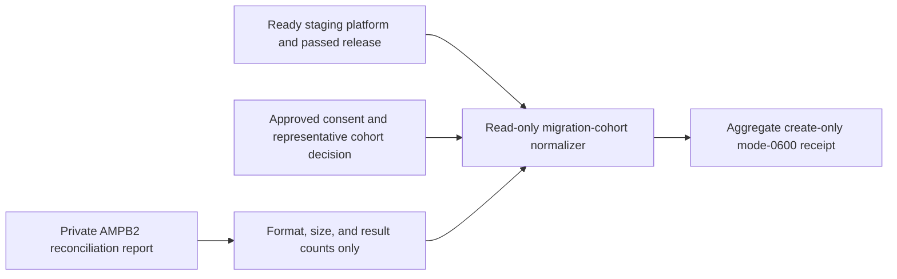

# Representative staging migration-cohort evidence

CP9-A requires a real, consented internal cohort—not merely a successful unit
test. This collector binds aggregate AMPB2 migration results to the exact ready
self-managed staging platform and passed release that processed them.



The input requires positive PDF, EPUB, Markdown, text, small, medium, and large
coverage. Expected items must equal both the selected source/memory/note total
and the imported/merged/skipped/failed reconciliation total. Readiness requires
zero failed items, unexplained losses, and duplicate publications plus all nine
fixed checks.

Keep account IDs, tenant IDs, filenames, titles, item IDs, source contents,
failure messages, and operator identities in the private immutable dossier.
Only opaque versions, aggregate counts, and SHA-256 digests enter the normalized
input and receipt.

```sh
make saas-migration-cohort-check \
  PLATFORM_INVENTORY=/private/staging-inventory.json \
  PLATFORM_PLAN=/private/staging-plan.json \
  PLATFORM_CHANGE=/private/staging-change.json \
  STAGING_RELEASE=/private/staging-release.json \
  MIGRATION_COHORT_INPUT=/private/migration-cohort.json \
  MIGRATION_COHORT_RECEIPT=/private/migration-cohort-receipt.json
```

Exit `0` is ready, `3` valid-unready, `2` invalid usage, and `1` invalid
evidence or I/O failure. The example proves shape only. CP9-A remains open
until the real cohort report is retained immutably and Product and QA approve
its exact dossier through the signed external-evidence index.
