# Staging object-custody review

This runbook normalizes the CP4-A Security review for one real self-managed
staging release. It does not retrieve policies, execute probes, query logs or
traces, or receive infrastructure credentials. Security performs the review
through approved private tooling and gives this command only content-free
digests and outcomes.

## Boundary

Use the exact staging platform inventory, infrastructure plan, ready applied-
change receipt, and passed Kubernetes release receipt. Keep the effective
policy exports, service-identity configuration, positive and negative object-
capability probe output, vault/audit immutability results, promotion result,
and sampled log and trace exports in a private immutable dossier.

Never put policy bodies, workload manifests, credentials, endpoints, bucket or
object names, resource names, tenant/account/workspace/source IDs, filenames,
paths, commands, logs, traces, customer content, or raw output in the review
JSON. Put only each private artifact's SHA-256 in its fixed check.

## Review flow

```mermaid
flowchart LR
    Chain["Validate staging inventory, plan, and applied change"] --> Release["Validate the passed staging release"]
    Release --> Policy["Export and review effective object policies"]
    Policy --> Capabilities["Probe API, worker, and reconciler capabilities"]
    Capabilities --> Custody["Verify vault, quarantine, and audit custody"]
    Custody --> Telemetry["Sample logs, traces, and telemetry access"]
    Telemetry --> Hash["Hash private evidence artifacts"]
    Hash --> Receipt["Publish the content-free normalized receipt"]
```



The review may start only after both the infrastructure change and release
complete, may run for at most eight hours, and must be normalized within 24
hours of input generation. A failed check is useful evidence: set `ready` to
`false`, retain the valid-unready receipt, and investigate. Never change a
failed outcome merely to obtain exit `0`.

Start from `docs/saas/staging-object-custody-review.example.json`, validate it
against `api/evidence/v1/staging-object-custody-review.schema.json`, and replace
every illustrative identity, digest, and timestamp with the exact review data.

## Normalize

```sh
make saas-object-custody-check \
  PLATFORM_INVENTORY=/private/staging-inventory.json \
  PLATFORM_PLAN=/private/staging-plan.json \
  PLATFORM_CHANGE=/private/staging-change.json \
  STAGING_RELEASE=/immutable/staging-release.json \
  OBJECT_CUSTODY_REVIEW=/private/object-custody-review.json \
  OBJECT_CUSTODY_RECEIPT=/immutable/object-custody-receipt.json
```

The destination must not already exist and is published mode `0600`. Exit `0`
means all ten checks passed; `3` means the input is valid but at least one check
failed; `2` means invalid arguments; and `1` means unsafe, malformed, stale,
misbound, or operational failure. Standard output contains aggregate counts
only. The receipt conforms to
`api/evidence/v1/staging-object-custody-receipt.schema.json`.

## Approval and retention

Store the exact input, normalized receipt, all four bound receipts, and every
private review artifact outside the application database under immutable
retention. Build the CP4-A dossier from those unchanged files, then have the
authorized Security owner sign its digest through the external-evidence index.

Local MinIO/Floci tests, examples, mocks, or a disposable cluster prove only
the implementation. They do not prove the effective staging policies or
telemetry and do not close CP4-A.
