# Staging operational-safety drills

This workflow normalizes the three deployed demonstrations required by CP1-B:
live application rollback, managed-secret rotation, and human operator access.
It does not perform any drill, rotate a secret, grant access, or approve a
release. Those actions stay under the self-managed platform's human controls.

## Evidence boundary

Start with the exact staging inventory, reviewed plan, ready applied change,
passed baseline release, later failed rollback-succeeded release attempt, and
the live rollback-verification receipt. Conduct the two remaining exercises in
the same reviewed staging epoch and keep their private artifacts immutably.

```mermaid
flowchart LR
    Platform["Validate inventory, plan, and ready change"] --> Releases["Validate passed baseline and failed rollback attempt"]
    Releases --> Rollback["Reload live rollback verification"]
    Rollback --> Secret["Review seven managed-secret rotation checks"]
    Secret --> Operator["Review seven human operator-access checks"]
    Operator --> Receipt["Publish content-free operational-safety receipt"]
    Receipt --> Dossier["Retain private CP1-B dossier and signatures"]
```



The secret-rotation exercise proves managed replacement creation, workload
rollout, rejection of the old value, acceptance of the new value, service
recovery, immutable audit retention, and absence of customer content. The
operator exercise proves verified human identity, independent approval,
least-privilege scope, enforced expiry, revocation, immutable audit retention,
and absence of customer content.

Every check records only `passed`, `failed`, or `inconclusive` plus the SHA-256
of its private evidence. Keep people, secret names/versions/values, tickets,
commands, endpoints, topology, audit rows, logs, traces, SQL, credentials, and
customer data out of both JSON files.

## Normalize

Copy `staging-operational-safety-drills.example.json`, replace every
illustrative identifier, digest, timestamp, and outcome, and validate it against
`api/evidence/v1/staging-operational-safety-drills.schema.json`.

```sh
make saas-operational-safety-check \
  PLATFORM_INVENTORY=/private/staging-inventory.json \
  PLATFORM_PLAN=/private/staging-plan.json \
  PLATFORM_CHANGE=/private/staging-change.json \
  ROLLBACK_BASELINE=/immutable/passed-release.json \
  ROLLBACK_FAILED_ATTEMPT=/immutable/failed-release.json \
  ROLLBACK_RECEIPT=/immutable/rollback-verification.json \
  OPERATIONAL_SAFETY_DRILLS=/private/operational-drills.json \
  OPERATIONAL_SAFETY_RECEIPT=/immutable/operational-safety-receipt.json
```

Both drills begin after the passed baseline, last at most four hours, and must
be normalized within 24 hours after live rollback verification. The destination
must not exist and is published atomically with mode `0600`. Exit `0` means all
fourteen checks and rollback passed; `3` means a valid failed/inconclusive drill;
`2` means invalid arguments; and `1` means malformed, unsafe, stale, misbound,
or operational failure. Standard output contains aggregate counts only. The
receipt conforms to
`api/evidence/v1/staging-operational-safety-receipt.schema.json`.

## Retention and approval

Retain all seven exact bound receipts, the drill input, normalized receipt,
secret-manager/rollout evidence, human approval and access records, immutable
audit exports, and content-absence proof outside the application database.
Build the `cp1_b` dossier from those unchanged artifacts and have authorized
Security and Operations owners sign its exact digest through the external-
evidence index.

Local-alpha secret and operator rehearsals, fixture JSON, and repository tests
prove the implementation only. They do not close CP1-B.
