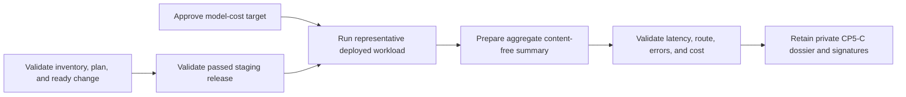

# Deployed staging retrieval load and model-cost evidence

This workflow normalizes CP5-C evidence that one representative installed-site
retrieval run stayed within the fixed search-p95 target and an externally
approved model-cost ceiling. It does not generate traffic, read telemetry, call
a model provider, calculate provider pricing, or approve a target.

## Evidence boundary

Operations retains the private workload manifest and full load/saturation
report. Product and Operations retain the model-cost report and approved target
decision. The content-free summary binds those exact artifacts and the staging
inventory, reviewed plan, ready change, and passed release.



Use opaque versions for the workload, site, route, and target. Do not include
facility, region, provider, endpoint, model, tenant/account/customer/source/
passage identifiers, corpus/query/prompt/model input or output, credentials,
pricing terms, raw latency samples, saturation series, logs, traces, SQL, or raw
output.

## Normalize

Copy `staging-retrieval-load.example.json`, replace every illustrative value,
validate it against the input schema, and run:

```sh
make saas-retrieval-load-check \
  PLATFORM_INVENTORY=/private/staging-inventory.json \
  PLATFORM_PLAN=/private/staging-plan.json \
  PLATFORM_CHANGE=/private/staging-change.json \
  STAGING_RELEASE=/immutable/passed-release.json \
  RETRIEVAL_LOAD_INPUT=/private/retrieval-load-summary.json \
  RETRIEVAL_LOAD_RECEIPT=/immutable/retrieval-load-receipt.json
```

Target approval precedes the run. The run starts after the bound deployment,
lasts no more than 24 hours, and is normalized within 24 hours. Percentiles use
integer microseconds and must be ordered. Ready requires zero request errors,
at least one model call, p95 strictly below 800,000 microseconds, and observed
integer micro-US dollars per 1,000 requests at or below the approved positive
ceiling. Honest failures or breaches remain valid-unready.

The destination must not exist and is atomically published with mode `0600`.
Exit `0` means all eight outcomes and metrics pass; `3` means valid-unready; `2`
means invalid arguments; and `1` means malformed, unsafe, stale, contradictory,
misbound, or operational failure. Output contains aggregate metrics only.

## Retention and approval

Build the `cp5_c` dossier from the exact platform/release inputs, workload
manifest, private load/cost reports, target decision, content-free input, and
normalized receipt. Product and Operations sign its digest through the external
evidence index. The local 200-request generation-disabled rehearsal cannot close
CP5-C because it has no deployed-site capacity or model-cost evidence.
