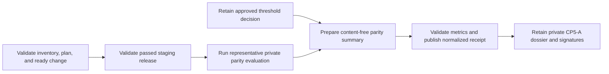

# Representative staging retrieval parity

This workflow normalizes CP5-A evidence that an approved retrieval-parity
threshold was met by a representative SQLite-to-hosted evaluation of one exact
staging release. It does not run a benchmark, connect to retrieval systems, or
approve a threshold.

## Evidence boundary

Retain the private threshold decision and full immutable parity report outside
the application database. The normalized input binds their exact digests and
the staging inventory, reviewed plan, ready applied change, and passed release.



The summary contains opaque threshold, dataset, and evaluation versions,
aggregate case count, approved and observed overlap/score-delta metrics, and
exactly eight fixed outcomes. Each outcome contains only `passed`, `failed`, or
`inconclusive` and a private evidence SHA-256.

Do not include corpus or query text, passage/source/tenant/account identifiers,
candidate ordering or scores, citation IDs, free-form explanations, model
input/output, credentials, endpoints, logs, traces, SQL, or raw output. Those
remain only in the immutable private report.

## Normalize

Copy `staging-retrieval-parity.example.json`, replace every illustrative value,
validate it against the input schema, and run:

```sh
make saas-parity-evidence-check \
  PLATFORM_INVENTORY=/private/staging-inventory.json \
  PLATFORM_PLAN=/private/staging-plan.json \
  PLATFORM_CHANGE=/private/staging-change.json \
  STAGING_RELEASE=/immutable/passed-release.json \
  PARITY_EVIDENCE_INPUT=/private/parity-summary.json \
  PARITY_EVIDENCE_RECEIPT=/immutable/parity-receipt.json
```

Threshold approval must precede evaluation. Evaluation starts after the bound
release, lasts no more than 24 hours, and is normalized within 24 hours. The
normalizer independently compares observed overlap and score delta with the
approved threshold. Honest failed/inconclusive outcomes or metric breaches are
valid-unready.

The destination must not exist and is published atomically with mode `0600`.
Exit `0` means all eight outcomes and both metrics pass; `3` means
valid-unready; `2` means invalid arguments; and `1` means malformed, unsafe,
stale, contradictory, misbound, or operational failure. Output contains only
aggregate counts and metrics.

## Retention and approval

Retain all five bound platform/release inputs, the threshold decision, full
parity report, content-free summary, normalized receipt, and generated report
outside the application database. Build the `cp5_a` dossier from those exact
artifacts and have authorized Product and Engineering owners sign its digest
through the external-evidence index. The repository fixture and local-alpha
parity run do not close CP5-A.
