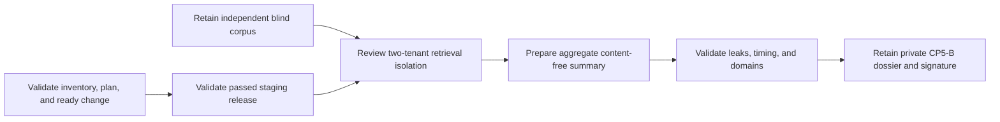

# Independent staging retrieval-risk review

This workflow normalizes CP5-B evidence from an independent blind two-tenant
retrieval review. It does not run probes, select a corpus, inspect cache keys,
or approve risk.

## Evidence boundary

The reviewer retains the blind corpus, raw timing samples, statistical report,
cache-key review, findings, retests, and risk-tolerance decision in immutable
private storage. The content-free summary binds those artifacts and the exact
staging inventory, reviewed plan, ready change, and passed release.



The summary contains exactly two tenants; bounded case and per-class timing
sample counts; aggregate result, public-count, and cache leak counts; and an
approved versus observed timing delta in integer microseconds. Seven fixed
domains cover corpus independence, results, counts, statistical timing,
cache-key namespace, warm-cache contamination, and risk acceptance.

Do not include reviewer identity, corpus/query/marker content, tenant/account/
workspace/source/passage/citation/cache-key identifiers, timing distributions,
statistical findings, attack details, endpoints, credentials, logs, traces,
SQL, or raw output.

## Normalize

Copy `staging-retrieval-risk-review.example.json`, replace every illustrative
value, validate it against the input schema, and run:

```sh
make saas-retrieval-risk-check \
  PLATFORM_INVENTORY=/private/staging-inventory.json \
  PLATFORM_PLAN=/private/staging-plan.json \
  PLATFORM_CHANGE=/private/staging-change.json \
  STAGING_RELEASE=/immutable/passed-release.json \
  RETRIEVAL_RISK_REVIEW=/private/retrieval-risk-review.json \
  RETRIEVAL_RISK_RECEIPT=/immutable/retrieval-risk-receipt.json
```

The review starts after the bound release, lasts no more than fourteen days,
and is normalized within 24 hours. Positive leak counts and timing breaches
must agree with failed domains. Honest failures and inconclusive results remain
valid-unready.

The destination must not exist and is atomically published with mode `0600`.
Exit `0` means all seven domains pass with zero leaks and timing within the
approved tolerance; `3` means valid-unready; `2` means invalid arguments; and
`1` means malformed, unsafe, stale, contradictory, misbound, or operational
failure. Output contains aggregate counts and timing values only.

## Retention and approval

Build the `cp5_b` dossier from the exact platform/release inputs, private
corpus, timing/cache/risk artifacts, content-free input, and normalized receipt.
An authorized independent-security reviewer signs its digest through the
external-evidence index. Local rehearsal and CP2-A evidence do not close CP5-B.
