# Staging safe-platform launch state

This workflow collects the technical half of CP1-C: the exact staged platform
and release are bound to an installed launch policy that cannot admit customers.
It does not approve a launch and cannot enable or freeze signup. Product's
signed external decision remains mandatory.

## Boundary

Use the exact staging platform inventory, reviewed infrastructure plan, ready
applied-change receipt, and passed Kubernetes release receipt. Together, the
inventory/plan/change chain is the sanitized exposure inventory: it records the
reviewed public edge and identity ingress while keeping service and data
capabilities private.

The collector opens PostgreSQL with a read-only transaction and executes one
fixed singleton query. It reads only phase, signup enabled, invitation required,
policy version, and policy update time. It never reads accounts, tenants,
invitations, signup attempts or reservations, customer content, countries,
quotas, feature flags, actors, reasons, endpoints, credentials, SQL output, or
row counts.

```mermaid
flowchart LR
    Inventory["Load staging inventory"] --> Plan["Validate reviewed exposure plan"]
    Plan --> Change["Validate ready applied change"]
    Change --> Release["Validate passed staging release"]
    Release --> Policy["Observe five launch-policy fields read-only"]
    Policy --> Receipt["Publish content-free mode-0600 receipt"]
    Receipt --> Dossier["Retain immutable CP1-C dossier"]
    Dossier --> Approval["Product signs exact dossier digest"]
```



Ready means phase is `internal_alpha`, signup is disabled, invitations remain
required for any later controlled enablement, the policy version is bounded,
and its timestamp is not in the future. Invitation-only signup is not treated
as closed because a valid or leaked invitation can still admit an account.

## Collect

Set `AGENT_MEMORY_POSTGRES_URL` in the operator environment; never pass it as a
flag or store it in the dossier.

```sh
AGENT_MEMORY_POSTGRES_URL='postgres://redacted' \
make saas-launch-state-collect \
  PLATFORM_INVENTORY=/private/staging-inventory.json \
  PLATFORM_PLAN=/private/staging-plan.json \
  PLATFORM_CHANGE=/private/staging-change.json \
  STAGING_RELEASE=/immutable/staging-release.json \
  LAUNCH_STATE_RECEIPT=/immutable/staging-launch-state.json
```

The destination must not exist and is published atomically with mode `0600`.
Exit `0` means safely closed; `3` means a valid observation is unready; `2`
means invalid arguments; and `1` means missing configuration, malformed or
misbound evidence, or operational failure. Standard output contains only phase,
readiness, and whether the receipt was written. The receipt conforms to
`api/evidence/v1/staging-safe-platform-launch-state.schema.json`. The adjacent
example is illustrative and never proves a deployed control.

## Approval and retention

Retain the exact four upstream receipts, the generated launch-state receipt,
and private exposure/policy evidence outside the application database under
immutable retention. Build the `cp1_c` dossier from those unchanged files and
have the authorized Product owner sign its digest through the external-evidence
index workflow.

Repository tests and disposable PostgreSQL prove only implementation behavior.
They do not prove that staging remained customer-free and do not close CP1-C.
