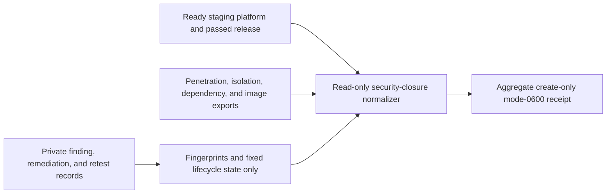

# Independent exploitable-finding closure evidence

P10.2-B needs more than a green container scan. This collector binds four
independent assessment sources and a content-free finding register to the exact
ready staging platform/change/release chain.



Every source has positive expected and observed target counts. Exactly four
sources are required: application penetration, tenant isolation,
dependency/supply-chain, and container image. A high or critical finding that
is exploitable—or whose exploitability is still inconclusive—blocks readiness
until it is closed and its independent retest passes. Any inconclusive
exploitability classification also keeps classification coverage unready.

The normalized register includes only SHA-256 fingerprints, fixed enums, and
evidence digests. Keep finding text, CVEs, affected packages/images/endpoints,
attack details, tickets, reviewer identity, and raw reports in private immutable
custody.

```sh
make saas-security-closure-check \
  PLATFORM_INVENTORY=/private/staging-inventory.json \
  PLATFORM_PLAN=/private/staging-plan.json \
  PLATFORM_CHANGE=/private/staging-change.json \
  STAGING_RELEASE=/private/staging-release.json \
  SECURITY_CLOSURE_INPUT=/private/security-closure.json \
  SECURITY_CLOSURE_RECEIPT=/private/security-closure-receipt.json
```

Exit `0` is ready, `3` valid-unready, `2` invalid usage, and `1` invalid
evidence or I/O failure. The example proves shape only and does not close
P10.2-B. The real independent reports, remediation/retest evidence, and signed
Security approval enter through the external-evidence index.
