# Independent staging tenant-isolation review

This runbook normalizes CP2-A evidence from an independent security review of
one real self-managed staging release. The command does not execute security
tests, query PostgreSQL or caches, contact the deployment, or receive
infrastructure credentials. The reviewer uses independent private tooling and
provides only content-free outcomes and artifact hashes.

## Boundary

Start with the exact staging platform inventory, infrastructure plan, ready
applied-change receipt, and passed Kubernetes release receipt. The independent
review must cover all six domains:

1. control-API authentication, authorization, membership, and capabilities;
2. forced RLS effectiveness and application/database defense in depth;
3. cross-tenant identifier and resource substitution;
4. cache namespace, invalidation, warm-path, and poisoning behavior;
5. generic error, count, status, pagination, and existence concealment; and
6. blinded timing-inference analysis with a reviewer-approved method.

Keep the corpus, requests, SQL/RLS inspection, identifiers, cache keys, timing
samples and thresholds, topology, findings, remediation, and retests in the
private immutable dossier. Never put reviewer identity, tenant/account/
workspace/source IDs, queries, schemas, endpoints, credentials, logs, traces,
customer content, finding text, or raw output in the review JSON.

## Review flow

```mermaid
flowchart LR
    Chain["Validate staging inventory, plan, and applied change"] --> Release["Validate the passed staging release"]
    Release --> Scope["Freeze the six-domain independent review scope"]
    Scope --> Test["Run private adversarial analysis and retests"]
    Test --> Hash["Hash each private domain report"]
    Hash --> Normalize["Publish the content-free normalized receipt"]
    Normalize --> Approve["Sign the immutable CP2-A dossier digest"]
```



The review starts only after both deployments complete and may span at most
fourteen days. Normalize the generated input within 24 hours. A passed domain
must have zero known cross-tenant findings. A failed domain must report at
least one; an inconclusive domain preserves uncertainty without inventing a
finding. Failed and inconclusive receipts exit unready and must be retained.

Start from `docs/saas/staging-tenant-isolation-review.example.json`, validate
it against `api/evidence/v1/staging-tenant-isolation-review.schema.json`, and
replace every illustrative identity, digest, timestamp, and outcome.

## Normalize

```sh
make saas-isolation-review-check \
  PLATFORM_INVENTORY=/private/staging-inventory.json \
  PLATFORM_PLAN=/private/staging-plan.json \
  PLATFORM_CHANGE=/private/staging-change.json \
  STAGING_RELEASE=/immutable/staging-release.json \
  ISOLATION_REVIEW=/private/tenant-isolation-review.json \
  ISOLATION_REVIEW_RECEIPT=/immutable/tenant-isolation-receipt.json
```

The destination must not already exist and is published mode `0600`. Exit `0`
means all six domains passed with zero findings; `3` means valid but failed or
inconclusive; `2` means invalid arguments; and `1` means unsafe, malformed,
stale, misbound, or operational failure. Standard output contains aggregate
domain and finding counts only. The receipt conforms to
`api/evidence/v1/staging-tenant-isolation-receipt.schema.json`.

## Approval and retention

Retain the exact input, normalized receipt, all four bound receipts, private
domain reports, remediation, and retests outside the application database
under immutable retention. Build the CP2-A dossier from those unchanged files,
then have the authorized independent-security owner sign its digest through the
external-evidence index.

Repository tests, local-alpha isolation/load receipts, mocks, and disposable
deployments validate only the implementation. They do not constitute an
independent review and do not close CP2-A.
