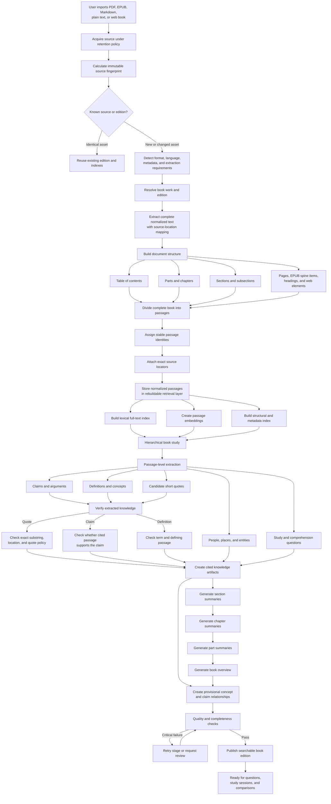
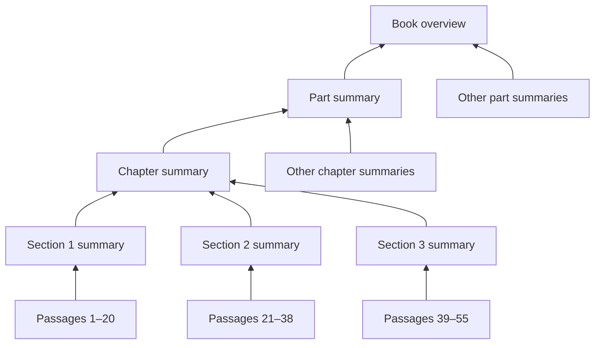
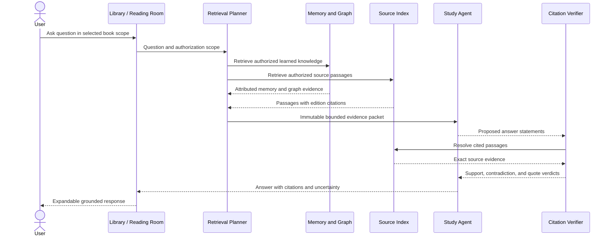
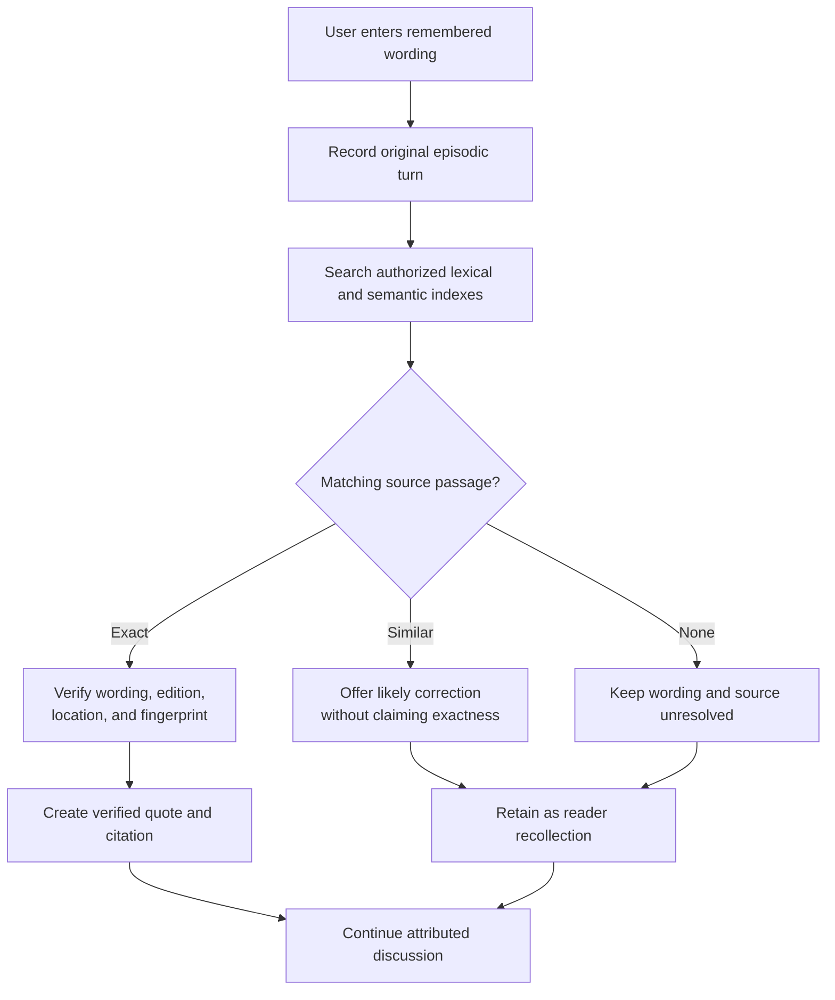

# Whole-Book Ingestion and Study Pipeline

**Status:** Design specification  
**Parent design:** [Living Knowledge Library](living-knowledge-library-design.md)  
**Implementation backlog:** [Living Knowledge Library tasks](living-knowledge-library-tasks.md)

## 1. Purpose

This document specifies how Agent Memory imports and reads an entire book before conversation begins. The ingestion engine converts a PDF, EPUB, Markdown/plain-text file, or captured web book into:

- a stable work, edition, and source identity
- a navigable table of contents and structural hierarchy
- source-addressable passages
- lexical, semantic, and structural indexes
- verified short quotes, claims, definitions, concepts, entities, and questions
- section, chapter, part, and book summaries
- provisional knowledge-graph relationships
- a searchable edition suitable for grounded conversations

The agent never attempts to place the entire book into one model context. It reads hierarchically:

```text
source → structure → passages → sections → chapters → parts → complete work
```

## 2. Whole-Book Ingestion Flow



## 3. Meaning of “Read the Whole Book”

Whole-book reading provides four distinct guarantees.

### 3.1 Complete extraction

Every readable page, spine item, section, paragraph, table, caption, footnote, and other supported structural unit is processed or explicitly reported as unreadable.

### 3.2 Complete indexing

Every passage permitted by the source policy can be retrieved later through exact, semantic, or structural search.

### 3.3 Hierarchical understanding

Passage-level knowledge is aggregated into section, chapter, part, and book-level representations without destroying links to the supporting passages.

### 3.4 Selective durable memory

Complete ingestion does not mean storing every sentence as memory. Only useful, permitted, and verified summaries, claims, short quotes, notes, questions, and insights enter durable Agent Memory.

The complete text belongs to the policy-controlled source and rebuildable retrieval planes:

| Plane | Whole-book responsibility |
|---|---|
| Source vault | Preserve the user-provided source and captured version according to policy |
| Retrieval layer | Preserve normalized passages, locations, indexes, and embeddings; rebuildable |
| Memory and graph | Preserve selected knowledge, permitted short quotes, provenance, and relationships |

If the source and normalized retrieval text are deleted, previously learned memories remain, but the system cannot answer new source-grounded questions requiring passages that were not retained.

## 4. Resulting Book Structure

```text
BookWork
└── BookEdition
    ├── Metadata
    │   ├── Title
    │   ├── Authors
    │   ├── Contributors
    │   ├── Language
    │   ├── Publisher
    │   ├── Publication date
    │   ├── ISBN or external identifiers
    │   └── Edition fingerprint
    │
    ├── SourceAsset
    │   ├── Format
    │   ├── Original-file fingerprint
    │   ├── Normalized-text fingerprint
    │   ├── Parser and normalization versions
    │   └── Retention policy
    │
    ├── Contents
    │   ├── Part 1
    │   │   ├── Chapter 1
    │   │   │   ├── Section 1.1
    │   │   │   └── Section 1.2
    │   │   └── Chapter 2
    │   └── Part 2
    │
    ├── Passages
    │   ├── Passage text
    │   ├── Structural location
    │   ├── Machine source location
    │   ├── Passage fingerprint
    │   └── Embedding
    │
    ├── Knowledge
    │   ├── Claims
    │   ├── Definitions
    │   ├── Concepts
    │   ├── Entities
    │   ├── Candidate and verified quotes
    │   └── Questions
    │
    └── Summaries
        ├── Section summaries
        ├── Chapter summaries
        ├── Part summaries
        └── Book overview
```

## 5. Source Acquisition and Identity

### 5.1 Acquisition

Before processing, the system records:

- importing principal and target library
- source format and media type
- acquisition timestamp and capture URL when relevant
- source-retention, search, quotation, sharing, export, and deletion policy
- original byte fingerprint

Unknown formats, disallowed sources, and policy violations fail before source text enters the retrieval pipeline.

### 5.2 Work, edition, and asset identity

The system maintains three related identities:

- `BookWork`: the abstract intellectual work
- `BookEdition`: a publication or materially distinct version of that work
- `SourceAsset`: the specific imported file or captured representation

Filename alone never determines identity. Matching may use bibliographic identifiers, normalized metadata, original-byte fingerprints, normalized-text fingerprints, and curator decisions.

Re-import behavior:

- Identical asset bytes reuse the existing asset and edition.
- Different packaging with identical normalized content may attach a new asset to the same edition after policy-controlled identity resolution.
- Materially changed content creates a new edition or edition revision.
- Historical citations retain the asset and locator against which they were originally verified.

## 6. Format Adapters and Extraction

Each adapter probes the source and extracts normalized content without losing source coordinates:

```go
type SourceAdapter interface {
    Probe(ctx context.Context, asset SourceAsset) (ProbeResult, error)
    Extract(ctx context.Context, asset SourceAsset) (ExtractedDocument, error)
}
```

### 6.1 EPUB

The adapter extracts package metadata, navigation documents, spine order, XHTML structure, images and captions where supported, footnotes, and EPUB CFI-compatible locations.

### 6.2 PDF

The adapter extracts page-aware text blocks, bounding coordinates, document outline, reading order, tables and captions where supported, and an explicit marker for pages requiring OCR. Native and OCR text remain distinguishable.

### 6.3 Markdown and plain text

The adapter extracts heading hierarchy, paragraphs, lists, tables, code blocks, lines, source byte ranges, and normalized offsets. Plain text uses deterministic structural heuristics when headings are unavailable.

### 6.4 Captured web books

The adapter creates a versioned capture containing the canonical URL, capture timestamp, content fingerprint, DOM-aware structure, selector-based locations, and applicable acquisition policy. A mutable URL alone is never acceptable citation evidence.

## 7. Document Structure

The structure builder produces ordered nodes such as:

```text
front matter
part
chapter
section
subsection
appendix
bibliography
index
```

Each structural node contains:

- stable ID within the edition
- node type and ordinal
- title and normalized title
- parent ID and ordered children
- source start and end locations
- extraction confidence
- provenance showing whether it came from an explicit table of contents or inference

An inferred table of contents remains distinguishable from one explicitly supplied by the publisher.

## 8. Passage Creation

Passages follow document meaning rather than arbitrary fixed token windows:

```text
Chapter
    ↓
Section
    ↓
Paragraph groups
    ↓
Semantic passages
```

Rules:

- never cross chapter boundaries
- prefer complete paragraphs and arguments
- preserve heading and structural context
- keep bounded overlap only where necessary
- record exact normalized offsets
- assign deterministic fingerprints
- identify tables, captions, footnotes, lists, quotations, and code separately
- preserve reading order separately from semantic grouping
- record chunker and normalization versions

Example passage:

```json
{
  "id": "passage_01J...",
  "edition_id": "edition_01J...",
  "source_asset_id": "asset_01J...",
  "structural_node_id": "section_3_2",
  "text": "Deliberate practice focuses on correcting specific weaknesses...",
  "breadcrumb": ["Part I", "Chapter 3", "Focused Practice"],
  "locator": {
    "format": "pdf",
    "page": 61,
    "start_offset": 442,
    "end_offset": 617
  },
  "fingerprint": "sha256:...",
  "normalization_version": "normalization-v1",
  "index_version": "passage-v1"
}
```

## 9. Citation and Locator Model

Every passage has both:

- a machine-resolvable locator used for retrieval and verification
- a human-readable breadcrumb used for display

| Format | Required machine locator |
|---|---|
| PDF | Page, text block or coordinates, and normalized offsets |
| EPUB | Spine item and EPUB CFI or equivalent range |
| Markdown | Heading path, source byte range, and normalized range |
| Plain text | Line or byte range and normalized range |
| Web | Capture ID, canonical URL, DOM selector, and offsets |

A citation contains:

- citation ID
- work, edition, and source-asset IDs
- structural-node ID and breadcrumb
- format-specific machine locator
- normalized passage fingerprint
- optional permitted short quote and quote-span offsets
- historical locator and any later relocation record
- verification record IDs

A display label such as “Chapter 3” is never sufficient on its own.

## 10. Retrieval Indexes

### 10.1 Lexical index

Used for exact phrases, remembered quotations, names, technical terms, rare wording, identifiers, and explicit references.

### 10.2 Semantic index

Used for conceptual questions, paraphrases, related ideas, analogous arguments, and questions expressed using different terminology.

### 10.3 Structural index

Used for chapter-scoped retrieval, table-of-contents navigation, neighboring context, chapter comparison, reading order, and progress tracking.

All candidate generation operates inside an authorization scope. Unauthorized passages cannot influence graph expansion, ranking, result counts, caching, or generation.

Indexes record their parser, normalization, chunker, embedding, and indexing versions. They can be rebuilt without changing work, edition, annotation, citation, or memory identity.

## 11. Hierarchical Book Study

Initial publication requires complete extraction and indexing, not exhaustive semantic analysis. Semantic enrichment may continue in resumable background stages.

### 11.1 Passage-level extraction

For each passage or structurally coherent passage group, the study engine may propose:

- claims and arguments
- definitions and terminology
- concepts and entities
- selected short quotation candidates
- examples and counterexamples
- study, comprehension, and reflection questions
- relationships to existing authorized knowledge

Every proposed artifact includes the passage IDs from which it was extracted.

### 11.2 Hierarchical aggregation



Higher-level summaries derive from lower-level summaries and selected supporting passages. Each summary preserves:

- input passage and summary IDs
- model and prompt/profile version
- attribution and derivation type
- supporting and challenging evidence
- verification and review state

The system never treats a hierarchical summary as if it were source text.

## 12. Short-Quote Extraction and Verification

Models may select quote candidates, but they never generate the authoritative quote text from memory. The final quote is copied from the resolved source span.


A verified quote requires:

- exact source substring
- edition and asset identity
- structural breadcrumb and machine locator
- passage and quote-span fingerprints
- quotation-policy approval
- verifier method, version, and timestamp

If the model changes wording, removes material, combines passages, or paraphrases, the result is not a direct quote. It may become an attributed claim or source summary instead.

## 13. Claim and Definition Verification

A claim is a structured description of what a passage states, not necessarily copied source text.

Example:

```text
Claim:
Deliberate practice targets specific weaknesses.

Attribution:
Book author

Supporting evidence:
Passages 341 and 342

Verification:
Passage 341 supports the claim.
Passage 342 elaborates it.

Confidence:
0.91
```

Verification asks independently:

1. Does the edition and citation exist?
2. Does the locator resolve to the expected passage?
3. Does the passage support the proposed claim or definition?
4. Is the attributed speaker the author, a quoted person, or an opposing position described by the author?

Claim-evidence verdicts include:

```text
supports
partially_supports
challenges
contradicts
insufficient
```

A real citation pointing to an unrelated passage does not make a claim valid.

## 14. Knowledge Graph Enrichment

The study pipeline may propose relationships such as:

```text
contains
states
defines
supports
challenges
contradicts
elaborates
applies_to
derived_from
similar_to
influenced
supersedes
```

Graph edges remain provisional until accepted by policy or review. Each edge records creator, evidence, confidence, creation time, review state, and applicable authorization scope. Similarity alone never implies support.

Graph enrichment is not required before the source becomes searchable. Delaying broad graph extraction reduces ingestion latency, cost, and graph pollution.

## 15. Publication Contract

A book edition becomes searchable only when:

- work, edition, and source fingerprints exist
- extraction completeness and unreadable regions are known
- document structure is stored
- every indexed passage has a resolvable machine locator
- authorization and retention policies are attached
- required lexical and structural indexes are complete
- semantic-index status is explicit
- extraction failures are visible and not presented as success
- all published artifacts record their processing versions

Claims, summaries, embeddings, graph edges, and selected quotes may continue enriching asynchronously. Their availability and review states remain visible.

## 16. Resumable Processing State

```text
queued
  → acquired
  → fingerprinted
  → identified
  → extracted
  → structured
  → chunked
  → indexed
  → studied
  → verified
  → published
```

Every stage records:

- stage and job identity
- input fingerprint
- processor and configuration version
- status and attempt count
- start and completion time
- output artifact identities
- error category and retryability

Stages are idempotent. If quote extraction fails, processing resumes from the semantic-study stage rather than reparsing the book. Parser or embedding upgrades rebuild only their derived artifacts.

Publication uses explicit states such as `processing`, `searchable_partial`, `searchable`, `failed`, and `superseded`; partial output is never presented as fully complete.

## 17. Conversation Handoff

Once published, the edition becomes available to the grounded conversation pipeline:



Conversation does not write directly into durable semantic memory. It creates an episodic study event and may propose reviewed memories with complete citation and derivation lineage.

## 18. Remembered-Quote Handling

A phrase entered by a user without an edition-specific location is a reader recollection, not a citation or verified quote.

Example:

```text
User recollection:
“All the road lead to Rome”

Initial classification:
Attribution: reader
Knowledge form: recollection
Verification: unverified
Source: unresolved
```

Processing flow:



The original wording is never silently rewritten. If a source is later found, the verified quote is added while the earlier recollection and conversation remain historically intact.

## 19. Quality and Evaluation

Every format needs fixtures covering:

- complete and malformed sources
- explicit and inferred contents
- repeated headings
- Unicode and normalization edge cases
- tables, footnotes, captions, and quotations
- multi-column PDF reading order
- scanned PDF pages and OCR confidence
- EPUB spine and CFI resolution
- changed web captures
- identical and materially changed re-imports
- exact, partial, contradictory, and unsupported claims
- remembered but inaccurately worded quotes
- deletion and source-retention modes
- unauthorized search and citation attempts

Required metrics include:

- extraction coverage and unreadable-region rate
- structure accuracy
- locator resolution rate
- identical re-import identity rate
- lexical and semantic retrieval quality
- quote exact-match rate
- claim entailment and attribution accuracy
- time and cost per stage, page, chapter, and complete book
- graph-edge acceptance rate
- authorization leakage rate, with a target of zero

## 20. Implementation Direction

Implementation proceeds through the backlog’s import-to-citation vertical slice:

1. define work, edition, source-asset, structure, policy, and locator contracts
2. persist identities additively
3. implement Markdown extraction and structure
4. import one Markdown edition idempotently
5. resolve and persist Markdown citations
6. add authorization-scoped passage search
7. implement grounded answers and verified memory proposals
8. repeat the same behavioral contract for EPUB, PDF, OCR, and captured web sources

The essential architecture is:

```text
Whole source
    → stable edition
    → complete structure
    → source-addressable passages
    → lexical + semantic + structural indexes
    → verified claims and short quotes
    → hierarchical summaries
    → searchable book
    → grounded conversations
    → selected durable memories
```

Whole-book ingestion is the foundation. Multi-agent conversations, knowledge graphs, and wiki projections depend on it and must not become competing sources of truth.

